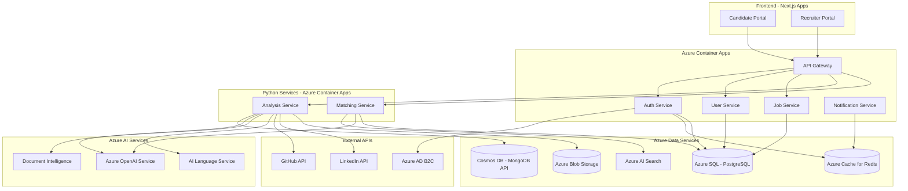

# Perfect-Fit MVP - Implementation Plan

**Focused MVP based on approved architectural decisions**

---

## 🎯 MVP Scope

### What We're Building

**Phase 1 MVP Features:**
1. ✅ User authentication (candidates + recruiters)
2. ✅ Candidate profile creation and management
3. ✅ Recruiter profile creation and management
4. ✅ Job posting by recruiters
5. ✅ Resume analysis (AI-powered)
6. ✅ GitHub profile and code analysis
7. ✅ LinkedIn profile analysis
8. ✅ Basic candidate-job matching
9. ✅ Candidate scorecard generation
10. ✅ Simple recruiter dashboard

### What We're Deferring
- ❌ Code execution assessments (future)
- ❌ AI interview companion (future)
- ❌ Video meetings (future)
- ❌ Advanced analytics (future)
- ❌ Mobile apps (future)

---

## ☁️ Approved Tech Stack

### Cloud Infrastructure

**Cloud Platform: Microsoft Azure (100%)**
- App Services / Container Apps
- Azure SQL Database (PostgreSQL)
- Azure Cosmos DB (MongoDB API)
- Azure Cache for Redis
- Azure Blob Storage
- Azure Container Registry
- Azure OpenAI Service (GPT-4, GPT-3.5, Embeddings)
- Azure AI Services (Document Intelligence, Language)
- Azure AI Search (Vector + Full-text search)
- Azure DevOps / GitHub Actions

**Benefits of Azure-Only:**
- Single cloud provider = simpler management
- Better integration between services
- Unified billing and monitoring
- No multi-cloud complexity
- Azure OpenAI offers GPT-4, GPT-3.5, Embeddings

---

### Core Tech Stack

#### Frontend Applications

**Candidate Portal & Recruiter Portal**
- **Framework:** Next.js 14+ (TypeScript)
- **Styling:** TailwindCSS + shadcn/ui
- **State:** Zustand + TanStack Query
- **Forms:** React Hook Form + Zod
- **Tables:** TanStack Table (recruiter dashboard)
- **Charts:** Recharts
- **HTTP:** Axios
- **Testing:** Vitest + React Testing Library

#### Backend Services

**Hybrid Monorepo Structure with NestJS**

**Services to Build:**
1. Auth Service (Azure AD + JWT)
2. User Service (profiles)
3. Job Service (job postings)
4. Analysis Service (resume/GitHub/LinkedIn)
5. Matching Service (candidate-job matching)
6. Notification Service (email alerts)

**Tech Stack:**
- **Framework:** NestJS (TypeScript)
- **Auth:** Azure AD B2C + custom JWT
- **Database ORM:** Prisma (PostgreSQL) + Mongoose (MongoDB)
- **Validation:** class-validator
- **API Docs:** Swagger/OpenAPI
- **Queue:** BullMQ + Redis
- **Logging:** Winston
- **Testing:** Jest + Supertest

#### AI/ML Services (Python)

**Analysis Services:**
- Resume Parser & Analyzer
- GitHub Code Analyzer
- LinkedIn Profile Analyzer
- Candidate Scoring Engine

**Tech Stack:**
- **Framework:** FastAPI (Python)
- **AI/ML:**
  - Azure OpenAI Service (GPT-4, GPT-3.5, text-embedding-ada-002)
  - Azure AI Document Intelligence (Resume parsing)
  - Azure AI Language (NER, sentiment analysis)
  - LangChain for orchestration (Azure OpenAI integration)
- **Resume Parsing:** Azure Document Intelligence + PyMuPDF
- **GitHub:** PyGithub
- **LinkedIn:** python-linkedin (or scraping with consent)
- **Vector DB:** Azure AI Search (built-in vectors)
- **Task Queue:** Celery + Redis
- **Testing:** Pytest

---

## 🗄️ Database Architecture

### Azure SQL Database (PostgreSQL)
**Tables:**
- `users` (candidates + recruiters)
- `candidate_profiles`
- `recruiter_profiles`
- `companies`
- `jobs`
- `applications`
- `auth_tokens`
- `audit_logs`

### Azure Cosmos DB (MongoDB API)
**Collections:**
- `resume_analyses`
- `github_analyses`
- `linkedin_analyses`
- `candidate_scorecards`
- `activity_logs`

### Azure Cache for Redis
**Use Cases:**
- Session storage
- Rate limiting
- API response caching
- Job queue (BullMQ)
- Real-time data

### Azure AI Search (Vector + Search)
**Indexes:**
- Resume embeddings
- Job descriptions
- Skill vectors
- Candidate search

---

## 🏗️ System Architecture (MVP)



---

## 📁 Repository Structure

### Hybrid Monorepo Approach

```
perfect-fit/
├── .github/
│   └── workflows/          # CI/CD pipelines
├── apps/
│   ├── candidate-portal/   # Next.js app
│   ├── recruiter-portal/   # Next.js app
│   └── landing-page/       # Marketing site
├── services/
│   ├── gateway/            # API Gateway (NestJS)
│   ├── auth/               # Auth Service (NestJS)
│   ├── user/               # User Service (NestJS)
│   ├── job/                # Job Service (NestJS)
│   ├── notification/       # Notification Service (NestJS)
│   ├── analysis/           # Analysis Service (Python/FastAPI)
│   └── matching/           # Matching Service (Python/FastAPI)
├── packages/
│   ├── ui-components/      # Shared React components
│   ├── shared-types/       # TypeScript types
│   ├── config/             # Shared configs
│   └── utils/              # Shared utilities
├── infrastructure/
│   ├── terraform/          # Azure + GCP IaC
│   ├── kubernetes/         # K8s manifests (if used)
│   └── docker/             # Dockerfiles
├── docs/
│   ├── api/                # API documentation
│   ├── architecture/       # Architecture diagrams
│   └── setup/              # Setup guides
├── scripts/
│   └── setup/              # Development setup scripts
├── package.json            # Root package.json (Turborepo)
├── turbo.json              # Turborepo config
├── nx.json                 # Nx config (alternative)
└── README.md
```

**Monorepo Tool:** Turborepo or Nx

---

## 🚀 12-Week MVP Roadmap

### Week 1-2: Foundation & Setup
**Infrastructure**
- [ ] Setup Azure account and resource groups
- [ ] Create Azure SQL Database (PostgreSQL)
- [ ] Create Azure Cosmos DB (MongoDB API)
- [ ] Setup Azure Cache for Redis
- [ ] Setup Azure Blob Storage
- [ ] Configure Azure AD B2C tenant
- [ ] Setup Azure OpenAI Service
- [ ] Setup Azure AI Document Intelligence
- [ ] Setup Azure AI Search

**Repository**
- [ ] Initialize monorepo (Turborepo)
- [ ] Setup ESLint, Prettier, TypeScript configs
- [ ] Create CI/CD pipelines (GitHub Actions)
- [ ] Setup Docker configurations
- [ ] Create development environment docs

**Team Setup**
- [ ] Development environment setup for all devs
- [ ] Code standards and conventions
- [ ] Git workflow (feature branches, PR process)

---

### Week 3-4: Authentication & User Service

**Auth Service (NestJS)**
- [ ] Implement Azure AD B2C integration
- [ ] Create JWT token generation/validation
- [ ] Implement refresh token flow
- [ ] Add password hashing (bcrypt)
- [ ] Create auth middleware
- [ ] API endpoints: register, login, logout, refresh
- [ ] Rate limiting on auth endpoints
- [ ] Unit tests for auth flows

**User Service (NestJS)**
- [ ] Prisma schema for users
- [ ] User CRUD operations
- [ ] Role-based access control (candidate/recruiter)
- [ ] Profile image upload (Azure Blob)
- [ ] Email verification flow
- [ ] User search functionality
- [ ] Unit + integration tests

**Database**
- [ ] Design and create PostgreSQL schema
- [ ] Run Prisma migrations
- [ ] Seed test data

---

### Week 5-6: Candidate & Recruiter Profiles

**Candidate Profile Service**
- [ ] Extended profile model (skills, experience, education)
- [ ] Resume upload to Azure Blob
- [ ] GitHub account linking
- [ ] LinkedIn account linking (OAuth)
- [ ] Profile completion tracking
- [ ] Profile visibility settings
- [ ] API endpoints for profile management
- [ ] Tests

**Recruiter Profile Service**
- [ ] Company profile creation
- [ ] Recruiter profile model
- [ ] Company verification workflow
- [ ] Team member invitations
- [ ] API endpoints
- [ ] Tests

---

### Week 7-8: Job Posting & Analysis Setup

**Job Service (NestJS)**
- [ ] Job posting model
- [ ] Create/edit/delete job postings
- [ ] Job status management (draft, active, closed)
- [ ] Job search and filtering
- [ ] Job embeddings for matching (Azure AI Search)
- [ ] API endpoints
- [ ] Tests

**Analysis Service Foundation (Python/FastAPI)**
- [ ] Setup FastAPI project
- [ ] Connect to Azure Cosmos DB
- [ ] Connect to Azure Blob Storage
- [ ] Connect to Azure OpenAI Service
- [ ] Connect to Azure Document Intelligence
- [ ] Setup Celery for async tasks
- [ ] Create base analysis models
- [ ] Tests

---

### Week 9-10: AI-Powered Analysis

**Resume Analysis**
- [ ] Resume parsing with Azure Document Intelligence
- [ ] Extract entities (skills, experience, education)
- [ ] Generate resume embeddings (Azure OpenAI)
- [ ] Quality scoring with GPT-4
- [ ] Consistency checking
- [ ] Store results in Cosmos DB
- [ ] API endpoints
- [ ] Tests

**GitHub Analysis**
- [ ] Connect to GitHub API
- [ ] Fetch user repositories
- [ ] Analyze commit history
- [ ] Code language analysis
- [ ] Project complexity scoring
- [ ] Contribution patterns
- [ ] Generate GitHub score
- [ ] Cache results
- [ ] API endpoints
- [ ] Tests

**LinkedIn Analysis**
- [ ] Connect to LinkedIn API (or scraping with consent)
- [ ] Extract work history
- [ ] Extract skills and endorsements
- [ ] Validate resume vs LinkedIn consistency
- [ ] Generate LinkedIn score
- [ ] API endpoints
- [ ] Tests

---

### Week 11: Matching & Scoring

**Matching Service (Python/FastAPI)**
- [ ] Candidate scorecard generation
- [ ] Combine resume, GitHub, LinkedIn scores
- [ ] Overall candidate scoring algorithm
- [ ] Job-candidate matching with Azure OpenAI
- [ ] Semantic search using Azure AI Search
- [ ] Match score calculation (cosine similarity)
- [ ] API endpoints
- [ ] Tests

**Candidate Scorecard**
- [ ] Generate comprehensive scorecard
- [ ] Technical skills score
- [ ] Experience score
- [ ] Consistency score
- [ ] GitHub activity score
- [ ] Overall fit score
- [ ] Store in Cosmos DB

---

### Week 12: Frontend Development

**Candidate Portal (Next.js)**
- [ ] Setup Next.js 14 app
- [ ] Setup TailwindCSS + shadcn/ui
- [ ] Authentication pages (login, register)
- [ ] Profile creation flow
- [ ] Resume upload interface
- [ ] GitHub/LinkedIn connection
- [ ] View personal scorecard
- [ ] Browse available jobs
- [ ] Apply to jobs
- [ ] Responsive design
- [ ] Tests

**Recruiter Portal (Next.js)**
- [ ] Setup Next.js 14 app
- [ ] Authentication pages
- [ ] Company profile setup
- [ ] Create/manage job postings
- [ ] View candidate applications
- [ ] Search candidates
- [ ] View candidate scorecards
- [ ] Dashboard with analytics
- [ ] Responsive design
- [ ] Tests

**Shared Components**
- [ ] Design system setup
- [ ] Reusable UI components
- [ ] Form components
- [ ] Table components
- [ ] Card components

---

### Week 13-14: Integration, Testing & Launch Prep

**Integration**
- [ ] End-to-end testing
- [ ] Integration testing across services
- [ ] Performance testing
- [ ] Security audit
- [ ] Bug fixes

**DevOps**
- [ ] Deploy to Azure staging environment
- [ ] Setup monitoring (Azure Monitor)
- [ ] Setup logging (Azure Log Analytics)
- [ ] Setup alerts
- [ ] Load testing
- [ ] Backup strategies

**Documentation**
- [ ] API documentation (Swagger)
- [ ] User guides
- [ ] Developer documentation
- [ ] Deployment runbooks

**Beta Launch Prep**
- [ ] Invite beta users (10-20 companies, 50-100 candidates)
- [ ] Feedback collection mechanism
- [ ] Support channels

---

## 💰 MVP Cost Estimate

### Azure Monthly Costs (Production)

| Service | Tier | Monthly Cost |
|---------|------|--------------|
| **App Services / Container Apps** | Basic tier (3 containers) | $200 - $400 |
| **Azure SQL Database** | Basic tier (PostgreSQL) | $150 - $300 |
| **Cosmos DB** | Serverless (MongoDB API) | $100 - $300 |
| **Redis Cache** | Basic (250 MB) | $20 - $50 |
| **Blob Storage** | Standard (100 GB) | $20 - $30 |
| **Azure AD B2C** | Free tier (50k MAU) | $0 - $50 |
| **Azure AI Search** | Basic tier | $75 |
| **Monitoring & Logs** | Basic | $50 - $100 |
| **Bandwidth** | Outbound | $50 - $100 |

**Azure Total: $665 - $1,400/month**

### GCP Monthly Costs (Trial Period)

| Service | Free Tier / Trial | After Trial |
|---------|-------------------|-------------|
| **Vertex AI** | $300 free credit + GenAI trial | $200 - $1,000/month |
| **Recommendations AI** | Trial credits | $100 - $500/month |

**GCP Total: $0 (during trial) → $300 - $1,500/month**

### Development Tools

| Tool | Cost |
|------|------|
| **GitHub** | Team plan | $4/user/month |
| **Monitoring (optional)** | New Relic / Datadog | $100 - $300/month |
| **Email Service** | SendGrid free tier | $0 - $20/month |

### Total MVP Monthly Cost
- **Development (low usage):** $500 - $1,000/month
- **Production (moderate usage):** $915 - $2,450/month
- **Scale (high usage):** $2,000 - $4,000/month

### One-Time Costs
- Domain & SSL: $50
- Initial setup & configuration: included in dev time
- Azure OpenAI Service application (if required): $0

### Free Tiers Available
- Azure Free Account: $200 credit for 30 days
- Azure OpenAI: Available with standard Azure subscription
- Azure AI Document Intelligence: 500 pages/month free
- Azure AI Language: 5,000 text records/month free

---

## 👥 Team Requirements (Minimum)

| Role | Count | Responsibility |
|------|-------|----------------|
| **Full-Stack Engineer** | 2 | Frontend + Backend |
| **Backend Engineer** | 1 | NestJS services |
| **AI/ML Engineer** | 1 | Python AI services |
| **DevOps Engineer** | 0.5 | Infrastructure & CI/CD |
| **UI/UX Designer** | 0.5 | Design system & UX |
| **Tech Lead** | 1 | Architecture & coordination |

**Total: 6 people** (some part-time)

---

## 🔐 Security Checklist

- [ ] Azure AD B2C configured properly
- [ ] JWT tokens with short expiry (15 min)
- [ ] Refresh tokens with rotation
- [ ] HTTPS/TLS everywhere
- [ ] Database connection encryption
- [ ] Secrets in Azure Key Vault
- [ ] Input validation on all endpoints
- [ ] Rate limiting (Redis)
- [ ] CORS configuration
- [ ] SQL injection prevention (Prisma)
- [ ] XSS prevention
- [ ] CSRF tokens
- [ ] File upload validation
- [ ] Virus scanning on uploads (Azure Defender)
- [ ] Audit logging
- [ ] GDPR compliance (data deletion, consent)

---

## 📊 Success Metrics (MVP)

### Technical KPIs
- API response time < 300ms (p95)
- Resume analysis < 30 seconds
- GitHub analysis < 60 seconds
- System uptime > 99%
- Zero critical security issues

### Business KPIs
- 50+ candidate registrations (beta)
- 10+ recruiter/company registrations (beta)
- 20+ job postings
- 100+ resume analyses completed
- User satisfaction > 4/5
- Profile completion rate > 70%

---

## 🎯 Next Steps

1. **Setup Azure and GCP accounts**
2. **Create repository structure**
3. **Setup development environment**
4. **Start Week 1 tasks**

---

## ⚠️ Risks & Mitigations

| Risk | Impact | Mitigation |
|------|--------|------------|
| **GCP trial credits expire** | High cost increase | Plan Azure OpenAI migration, monitor usage |
| **LinkedIn API access** | No LinkedIn analysis | Use alternative data sources or manual input |
| **GitHub API rate limits** | Analysis failures | Implement caching, use GitHub App authentication |
| **Complexity of Azure AD B2C** | Auth delays | Fallback to simple JWT if needed |
| **AI analysis quality** | Poor user experience | Human review loop, continuous model improvement |
| **Scope creep** | Delayed launch | Strict MVP scope, defer features to Phase 2 |

---

## 📝 Notes

- **Start small, iterate fast**
- Focus on core value: AI-powered resume + GitHub analysis
- Get beta users early (Week 10+)
- Collect feedback continuously
- Be ready to pivot based on user feedback

**Once you approve this plan, I'll start creating the repository structure and initial setup!** 🚀
